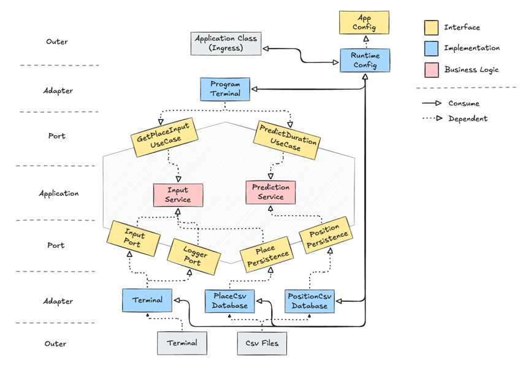

# Mission-Logistics

## Architecture

진정한 의미의 `Hexagonal Architecture`

Port의 역할
- in/port는 프로그램의 UseCase를 명세 (무엇을 할 수 있는지)
- out/port는 출력을 명세 (프로그램에서 외부에 있는 무엇을 사용하는지)

Service의 역할
- in/port(UseCase) 를 구현
- 도메인 로직을 처리

Adapter의 역할
- out/adapter 는 사용할 외부 기술을 구현
- in/adapter 는 프로그램에서 받는 입력을 처리

> 결과적으로 프로그램의 사용자는 in/adapter에 접근

과거의 구현과의 차이
- 과거 : 사용자가 입력을 하는 과정을 요청(사용)으로 간주
  - 요청과 결과 도출은 별개적 행위
- 현재 : Application 클래스에의 호출을 요청(사용)으로 간주
  - 사용자에게 입력을 받는 행위는 외부 기술(터미널)의 사용
  - 요청과 결과 도출은 원자적 행위

## Abstraction Level
- Application Level (가장 추상화된 레벨)
  - 하나의 프로그램 실행 플로우
  - in/adapter에 관한 관심사만 공유
    - 관심사를 확실히 구분하기 위해 AppConfig를 둠
    - 내부적으로는 service 들을 소비

- Service Level (비지니스 로직으로의 추상화)
  - 각 UseCase(in/port)에 대응되는 세부적인 구현 로직을 담당
  - out/port를 소비

- Implementation Level (세부 기술 구현)
  - 외부 기술과의 접점, 구현체
  - out/port를 구현

## Diagram

## Implementation Strategy

- 인터페이스와 제네릭을 활용해 다형성 확보
  - parsable 인터페이스를 각 모델에서 구현
  - csv를 로드할 때 하나의 파일로 처리 가능

- Exception Formating
  - Custom Exception의 인자를 개별적으로 포멧팅
  - 예외를 던질 때 파라미터를 적절히 구성하면 예외 단에서 메시지를 가공
